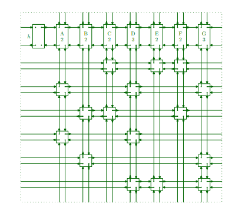
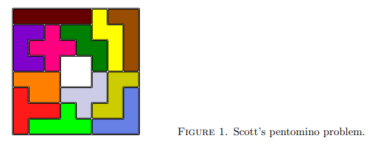
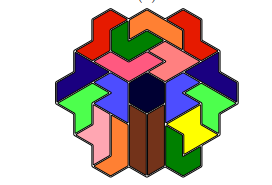




## 引言

我在翻看 [Knuth 最近的更新](https://www-cs-faculty.stanford.edu/~knuth/news.html)时，发现他每年圣诞节都会到斯坦福去做演讲，去年我也写(ken)了他的圣诞三重奏，
2023年圣诞的主题是 Dancing Cell，看了一下发现要理解就要先理解 Dancing Link，这个算法早在2011年我便听过，
只知道用来解数独很快，但并知道怎么做，更没有实现过，所以我决定先从Dancing Link入手学起。<!--more-->

## 精准匹配 Exact Cover
有一类问题叫精确匹配问题，给定一个n*m的01矩阵，要求选出若干行，使得每行中包含的1恰好在每列出现一次。
例如下面的矩阵：

|0|0|1|0|1|1|0|
|-|-|-|-|-|-|-|
|1|0|0|1|0|0|1|
|0|1|1|0|0|1|0|
|1|0|0|1|0|0|0|
|0|1|0|0|0|0|1|
|0|0|0|1|1|0|1|

可以看出选择第1、4和5行可以恰好让每列有且只有一个1。如何解这个问题呢，
一般就是朴素的搜索，选定一行再选定一行，只到无法接着选择或者收集到了所有1为止。
这个时间复杂度是非多项式时间，不考虑剪枝那就是2^n种选法。

## Algorithm X
早在2000年Knuth就提出了[Algorithm X 算法](https://arxiv.org/abs/cs/0011047)用来解决精准匹配问题，
面对上面的矩阵，算法过程像这样：

1. 当矩阵不为空时，选定含有1个数最少的那一列，这里是第一列
2. 删除这列
3. 把这列中有1的行选出来，这里是第2和4行
4. 对于选出来的行，将行删掉
5. 并且将这些行中1所在的列也删掉，这里第2行的第一、四和七列以及第4行的第一和四列是1，将这些列删掉（第一列已经被删了）
6. 将剩下的矩阵整理好（矩阵从6\*7变成了4\*4），从第1步开始继续，直到矩阵为空

解释下删除行和列为什么能解决匹配问题，实际上这个过程相当于在为后面的选择剪枝，
选出来第2行，删掉第2行很好理解，删掉第2行中是1的列表示不需要考虑这些列了，
涉及到的第4行被删因为它和第2行都有第一列的1，它不可能再被选到，
否则第一列就有两个1了，
如果不删掉第4行其他的1，那么假如有一次要选第四列
（这里虽然第四列在第2行时被删了，但比如这里时第五列第六列结论都成立），
那就有可能选到第四行，
但第四行选到也会因为第一列有1导致两个1而失败，所以第4行的其他1所在列也要删。

## 双向链表 Doubly Linked Lists
双向链表在数据结构课上都学过，我们也可以把上面的矩阵转换成链表表示，
当为1时加入一个链表节点，为0则不加，每个节点记录自己所在的矩阵坐标。
这里不仅是左右双向，还是上下双向，
再为每一列增加一个头指针，就像这样：

而对于水平或竖直方向的链表移除操作很简单：

```python
x.right.left = x.left
x.left.right = x.right
```

之所以说移除不说删除也是因为x并不会真的释放掉，它的数据还会保留，
稍后会再加回来，增加操作就是：

```python
x.right.left = x
x.left.right = x
```

## Dancing Link
一切准备就绪，接下来将这些合在一起就是Dancing Link了，
Dancing Link是一个奇妙的建模方法，
它不仅可以解数独，如果建模得当还能解决各种拼图问题，比如



不过我觉得这篇文章我已经讲的够多了，
我决定留到下一篇再说。

>> 图片均出自[Dancing Link 论文](https://arxiv.org/pdf/cs/0011047)
