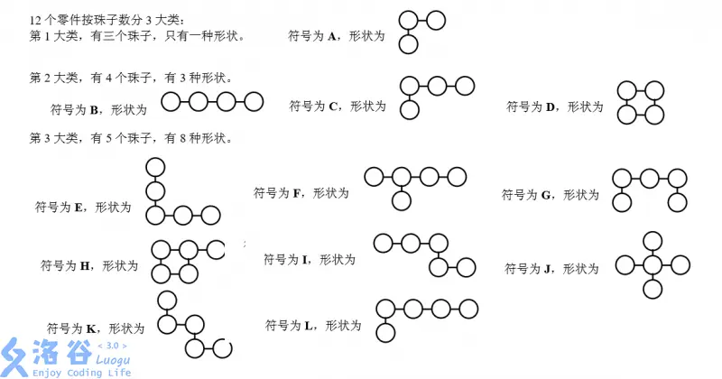
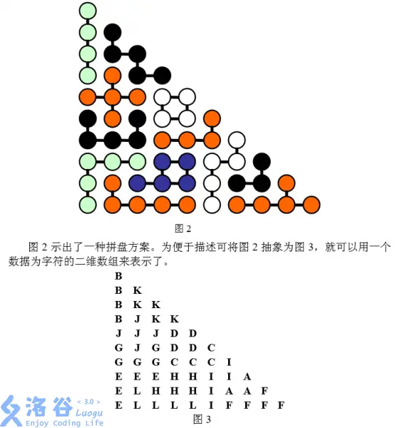



## 引言
我以前玩过一个叫智慧金字塔的儿童益智玩具，后来我发现它居然早在 [NOI 2005 就出现过](https://www.luogu.com.cn/problem/P4205)了，
我还写了一个程序[^1]专门来解这些题目，
上回说到将双向链表和 Algorithm X 结合起来就是 Dancing link了，
这次我们就来看看最关键的建模方法。
<!--more-->

## 智慧珠

### 题目背景

智慧金字塔在那年的题目里叫智慧珠，它有总共 12 种形状，这些形状
可以通过旋转和翻转来合理地放到底板上，只要尺寸合适，例如下图就是一种摆法：

这个题最直接的思路是将所有形状可能的摆放枚举出来，
然后将底板坐标化，如图按第一象限标记，左下角是(0, 0)，右顶点就是(0, 9)，上顶点是(9, 0)，总共有 55 个点可以摆放。

### 矩阵
接下来构造一个矩阵，矩阵一行有 55+12 个 01 值，一行代表将一个形状
放入底板时的情况，放入的坐标可以对应到前 55 个值，哪些坐标被填充
就置为 1，后 12 个表示这是第几个形状。因为一个形状最多占 5 个点，
所以一行**最多有 6 个 1**。

以左下角放的形状 E 为例，它占据了坐标是：(0, 0), (1, 0), (2, 0),
(2, 1), (2, 2)，编码在 0 到 54 就是对应的第 0、10、19、20 和 21
位是 1，它是第 5 个形状，那么还有第 59 位是 1。这一行矩阵长这样：

| 0| 1| 2|..|10|11|..|19|20|21|..|55|56|57|58|59|..|
|--|--|--|--|--|--|--|--|--|--|--|--|--|--|--|--|--|
| 1| 0| 0|..| 1| 0|..| 1| 1| 1|..| 0| 0| 0| 0| 1|..|

这个矩阵的行数就是所有形状的所有可能放入底板的集合个数。

### 精准匹配
构造完矩阵这个题就解决了一半，剩下就是一个精准匹配问题：
**从矩阵中挑出若干行，使得每一列恰好有且只有一个 1**，
前 55 列的 1 表示整个底板恰好被填满，后 12 列的 1 表示
每个形状恰好使用了一次。

### Algorithm X
再来回忆下 algorithm X，它通过不断删除矩阵种的行和列来加速搜索的效率。

### Dancing Link
我们知道对于矩阵无论删除行和列，都是线性时间，也就是 O(n) 或 O(m)。
但如果对于稀疏矩阵（前面提过一行 67 个值里最多有 6 个 1）用四向链表表示，
那就可以做到快速地移除和恢复，对应到 algorithm X 就相当与快速地选择一行并处理，以及回退。

## 总结
Dancing Link 并不神秘，它指的就是用四向链表的移除和恢复操作来达到快速迭代 algorithm X 的过程。

[^1]: <https://github.com/morefreeze/SapientialPyramid>
